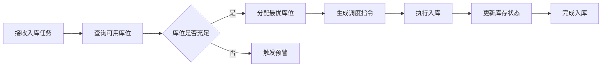
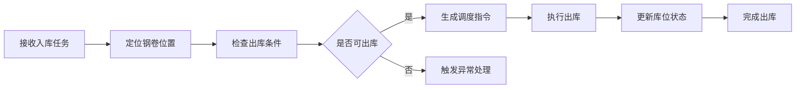

# 钢厂库区调度系统 - 产品需求文档

## 1. 产品概述

钢厂库区三维可视化调度系统，用于管理和调度2.7万平方米厂区内的钢卷库存。系统采用三跨布局（每跨30m×300m），提供实时库存监控、库位管理和调度优化功能。

- **主要目的**：实现库区库存的三维可视化管理，提高调度效率，减少人工错误
- **目标用户**：库区调度员、仓库管理员、生产管理人员
- **产品价值**：通过三维可视化提升库区管理效率30%以上，实现库存精准定位和智能调度

## 2. 核心功能

### 2.1 用户角色
| 角色 | 注册方式 | 核心权限 |
|------|---------|---------|
| 调度员 | 系统分配 | 库区调度、库存查询、任务管理 |
| 仓库管理员 | 系统分配 | 库存管理、库位维护、报表查看 |
| 生产管理人员 | 系统分配 | 全局监控、数据分析、决策支持 |

### 2.2 功能模块
1. **三维库区总览**：3D场景展示、库区布局、实时库存状态
2. **库位管理**：库位查询、库位状态、库位分配
3. **调度任务**：任务创建、任务执行、任务跟踪
4. **库存查询**：钢卷信息、库存统计、位置搜索
5. **数据分析**：库存报表、调度效率、库区利用率

### 2.3 页面详情
| 页面名称 | 模块名称 | 功能描述 |
|---------|---------|---------|
| 三维库区总览 | 3D场景 | 三跨库区三维展示，支持旋转、缩放、平移 |
| 三维库区总览 | 库存状态 | 实时显示各库位钢卷状态（空/满/占用） |
| 三维库区总览 | 信息面板 | 显示选中库位/钢卷的详细信息 |
| 库位管理 | 库位列表 | 按跨、行、列展示库位状态 |
| 库位管理 | 库位详情 | 显示库位规格、当前状态、历史记录 |
| 调度任务 | 任务列表 | 显示待执行、执行中、已完成任务 |
| 调度任务 | 任务创建 | 创建入库/出库/移库任务 |
| 库存查询 | 搜索功能 | 按钢卷号、规格、位置搜索 |
| 库存查询 | 统计图表 | 库存数量、重量、利用率统计 |
| 数据分析 | 报表展示 | 库存趋势、调度效率、库区热力图 |

## 3. 核心流程

### 3.1 入库调度流程

### 3.2 出库调度流程

## 4. 用户界面设计

### 4.1 设计风格
- **主色调**：深蓝色系（#1a2332）作为背景，体现工业感
- **辅助色**：橙色（#ff6b35）用于高亮和警告，绿色（#4caf50）表示正常状态
- **按钮风格**：圆角矩形，带微阴影，hover时有发光效果
- **字体**：标题使用 Orbitron（科技感），正文使用 Noto Sans SC
- **布局风格**：左侧导航 + 中央3D场景 + 右侧信息面板
- **图标风格**：线性图标，简洁工业风格

### 4.2 页面设计详情
| 页面名称 | 模块名称 | UI元素 |
|---------|---------|--------|
| 三维库区总览 | 3D场景 | Three.js渲染，工业风格材质，动态光照 |
| 三维库区总览 | 信息面板 | 卡片式布局，数据表格，状态指示器 |
| 库位管理 | 库位列表 | 表格展示，状态标签，筛选器 |
| 调度任务 | 任务列表 | 卡片列表，进度条，操作按钮 |

### 4.3 响应式设计
- **桌面优先**：主要针对1920×1080及以上分辨率设计
- **自适应布局**：支持1366×768及以上分辨率
- **触摸优化**：3D场景支持触摸手势操作

### 4.4 3D场景设计
- **环境氛围**：工业厂房风格，深色背景配合暖色灯光
- **灯光设置**：主光源（白色平行光）+ 辅助光（暖色点光源）+ 环境光
- **相机设置**：透视相机，支持轨道控制器（旋转、缩放、平移）
- **构图焦点**：三跨库区居中展示，钢卷用不同颜色区分状态
- **交互动画**：库位hover高亮，钢卷点击弹出信息，任务执行动画
- **后处理效果**：环境光遮蔽（AO）、泛光（Bloom）效果
- **性能预算**：控制在60fps，模型面数<100k，使用实例化渲染
