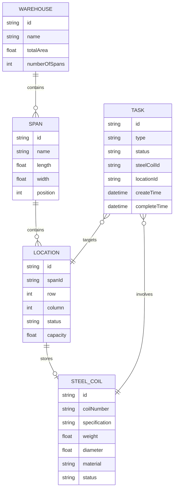

# 钢厂库区调度系统 - 技术架构文档

## 1. 架构设计

```mermaid
graph TB
    subgraph 前端层
        A[React 18 + TypeScript]
        B[Three.js 3D渲染]
        C[Zustand 状态管理]
        D[React Router 路由]
    end
    
    subgraph 数据层
        E[Mock数据服务]
        F[本地存储]
    end
    
    subgraph 3D场景层
        G[@react-three/fiber]
        H[@react-three/drei]
        I[@react-three/postprocessing]
    end
    
    A --> B
    A --> C
    A --> D
    B --> G
    G --> H
    G --> I
    A --> E
    E --> F
```

## 2. 技术说明

- **前端框架**：React 18 + TypeScript
- **构建工具**：Vite
- **3D渲染**：Three.js + @react-three/fiber + @react-three/drei
- **后处理**：@react-three/postprocessing
- **状态管理**：Zustand
- **路由**：React Router DOM
- **样式**：Tailwind CSS
- **图标**：Lucide React
- **数据**：Mock数据（本地JSON）

## 3. 路由定义

| 路由 | 用途 |
|------|------|
| / | 三维库区总览（默认首页） |
| /inventory | 库存管理 |
| /tasks | 调度任务 |
| /analytics | 数据分析 |

## 4. 数据模型

### 4.1 数据模型定义



### 4.2 数据结构定义

```typescript
// 库区跨度
interface Span {
  id: string;
  name: string;
  length: number;    // 300m
  width: number;     // 30m
  position: number;  // 1, 2, 3
}

// 库位
interface Location {
  id: string;
  spanId: string;
  row: number;
  column: number;
  status: 'empty' | 'occupied' | 'reserved';
  capacity: number;  // 吨
  steelCoilId?: string;
}

// 钢卷
interface SteelCoil {
  id: string;
  coilNumber: string;
  specification: string;
  weight: number;    // 吨
  diameter: number;  // mm
  material: string;
  status: 'in-stock' | 'reserved' | 'shipping';
  locationId?: string;
}

// 调度任务
interface Task {
  id: string;
  type: 'inbound' | 'outbound' | 'transfer';
  status: 'pending' | 'executing' | 'completed' | 'failed';
  steelCoilId: string;
  fromLocationId?: string;
  toLocationId?: string;
  createTime: string;
  completeTime?: string;
}
```

## 5. 项目结构

```
src/
├── components/
│   ├── 3d/                    # 3D场景组件
│   │   ├── WarehouseScene.tsx
│   │   ├── Span.tsx
│   │   ├── Location.tsx
│   │   └── SteelCoil.tsx
│   ├── layout/                # 布局组件
│   │   ├── Header.tsx
│   │   ├── Sidebar.tsx
│   │   └── InfoPanel.tsx
│   └── ui/                    # UI组件
│       ├── StatusBadge.tsx
│       ├── TaskCard.tsx
│       └── DataTable.tsx
├── pages/
│   ├── Dashboard.tsx          # 三维库区总览
│   ├── Inventory.tsx          # 库存管理
│   ├── Tasks.tsx              # 调度任务
│   └── Analytics.tsx          # 数据分析
├── hooks/
│   └── useWarehouse.ts        # 库区数据Hook
├── store/
│   └── warehouseStore.ts      # Zustand状态管理
├── data/
│   ├── warehouse.json         # 库区数据
│   ├── locations.json         # 库位数据
│   ├── coils.json             # 钢卷数据
│   └── tasks.json             # 任务数据
├── types/
│   └── index.ts               # TypeScript类型定义
└── utils/
    └── helpers.ts             # 工具函数
```

## 6. 3D场景技术实现

### 6.1 场景架构
- 使用 `@react-three/fiber` 作为React与Three.js的桥梁
- 使用 `@react-three/drei` 提供常用3D组件（轨道控制器、文本、环境等）
- 使用 `@react-three/postprocessing` 实现后处理效果

### 6.2 性能优化
- 使用实例化渲染（InstancedMesh）渲染大量钢卷
- 使用LOD（Level of Detail）根据距离调整模型细节
- 使用视锥体裁剪优化渲染性能
- 控制场景总面数在100k以内

### 6.3 交互实现
- 使用Raycaster实现鼠标拾取
- 使用Hover效果高亮选中对象
- 使用动画库实现平滑过渡效果
- 支持键盘快捷键操作
